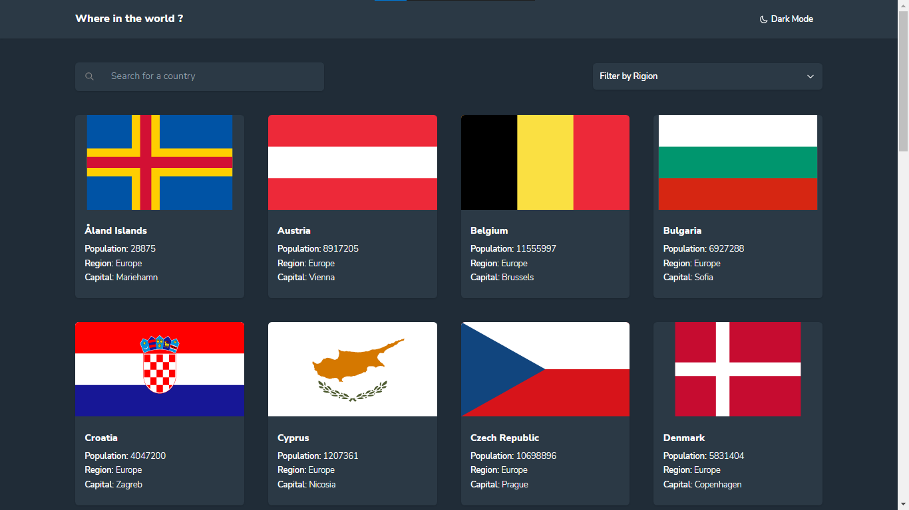

# REST Countries API with color theme switcher

This is a solution to the [REST Countries API with color theme switcher challenge on Frontend Mentor](https://www.frontendmentor.io/challenges/rest-countries-api-with-color-theme-switcher-5cacc469fec04111f7b848ca)

## Table of contents

## Table of contents

- [Overview](#overview)
  - [The challenge](#the-challenge)
  - [Screenshot](#screenshot)
  - [Links](#links)
- [My process](#my-process)
  - [Built with](#built-with)
  - [Useful resources](#useful-resources)
- [Author](#author)

## Overview

### The challenge

Users should be able to:

- See all countries from the API on the homepage
- Search for a country using an `input` field
- Filter countries by region
- Click on a country to see more detailed information on a separate page
- Click through to the border countries on the detail page
- Toggle the color scheme between light and dark mode *(optional)*

### Screenshot

### Links

- Live Site URL: [visite site](https://zakaria-lagouader.github.io/REST-Countries-API-with-color-theme-switcher)

## My process

### Built with

- [Vue](https://vuejs.org/) - JS library
- [Vue Router](https://router.vuejs.org/) - JS library
- [Vuex](https://vuex.vuejs.org/) - JS library
- [vue query](https://github.com/DamianOsipiuk/vue-query) - JS library
- [Tailwindcss](https://tailwindcss.com/) - Css library
- [Typescript](https://www.typescriptlang.org/) - Language

### Useful resources

- [Tailwindcss Docs](https://tailwindcss.com/docs/installation) - This helped me for the utility classes

## Author

- Website - [Zakaria Lagouader](https://zakaria-lagouader.github.io/portfolio/)
- Frontend Mentor - [@zakaria-lagouader](https://www.frontendmentor.io/profile/zakaria-lagouader)

